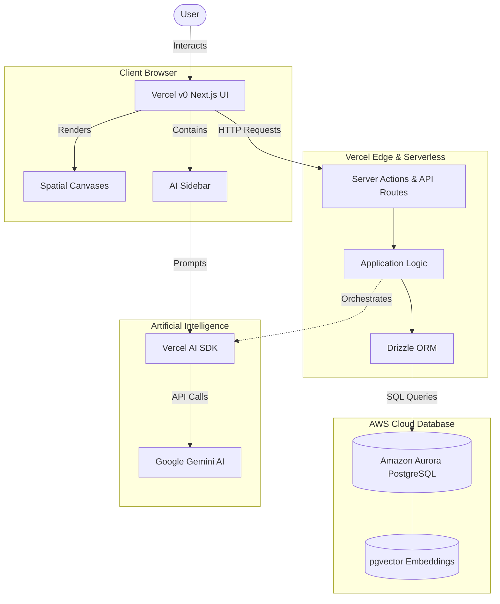

# Thinking Engine (Cothink) Architecture Diagram

This document outlines the high-level architecture of the **Thinking Engine** application, an AI-powered spatial workspace. It illustrates how the frontend connects to the backend services, databases, and AI providers.

## System Architecture

### Architectural Highlights

> [!NOTE]
> **Zero Stack Frontend (Vercel v0)**
> The application UI is built using **Next.js** and **Tailwind CSS**, heavily leveraging Vercel v0 for rapid prototyping. It features an infinite 2D spatial canvas and an AI sidebar for seamless thought organization.

> [!IMPORTANT]
> **Vercel Serverless Architecture**
> The backend runs entirely on the **Vercel Edge Network**. Application logic is handled through Next.js Server Actions and API Routes, ensuring low latency and high scalability without managing traditional servers.

> [!TIP]
> **Relational Data with Amazon Aurora**
> **Amazon Aurora PostgreSQL** is chosen over NoSQL to enforce strict relational integrity (users, folders, canvases, thoughts) while still supporting unstructured metadata via `JSONB`. It also paves the way for semantic vector search using `pgvector`. **Drizzle ORM** provides a fully typed interface to the database.

> [!NOTE]
> **AI Integration**
> The core generative features (AI Sidebar, note expansion) are powered by **Google Gemini AI**, orchestrated by the Vercel AI SDK to stream responses directly to the client's React components.
